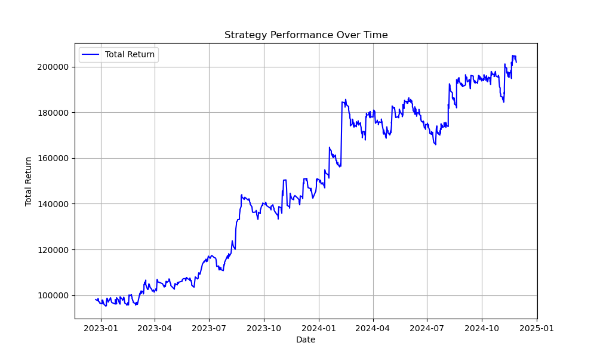

# Opening Range Breakout (ORB) Strategy

## Warning
1. **Testing Limitations**: This strategy has been tested on only 2 years of intraday data. It is not recommended for live trading unless you thoroughly test it and fully understand the code logic.
2. **Sample Data**: The `sample_data/historical_data_sample` folder contains only two sample files, which are insufficient for meaningful testing. You need more extensive data. The backtesting in this repository is performed using the tickers listed in `sample_data/tickers.csv`. The more data you use, the better your testing results will be.
3. **Historical Data Requirement**: To comply with this repository, place your historical data (in `.csv` format) in a folder named `historical_data_new`.

---

## Notes
1. **Entry and Exit**:
   - Entry signals use 1-minute data.
   - Exit signals use 5-minute data to reduce noise.
2. **Customizability**: The code is flexible and allows you to modify or add new rules. Several alternative rules, such as a trailing stop loss, are already implemented and commented out for future use.

---

## Understanding the Strategy
1. **Core Idea**: This is an Opening Range Breakout (ORB) strategy that selects the top 20 stocks each day based on predefined criteria.
2. **Entry Rules**:
   - The strategy examines the first 6 candles (from 09:30 to 09:35).
   - If 5 out of 6 candles are bullish, it enters a long position; otherwise, it enters a short position.
   - Additional conditions include entering a position only if the price is at least 0.25% below the previous day's close.
3. **Custom Rules**: Additional filters and criteria are implemented in the code. Review the comments to explore these rules.

---

## Implementation Details
1. **Data Requirements**:
   - The repository uses 2 years of intraday (1-minute) data for approximately 2,500 US stocks (listed in `sample_data/tickers.csv`).
   - Data is preprocessed to:
     - Retain only trading hours.
     - Fill missing data.
     - Calculate various indicators (e.g., ATR, Relative Volume).
   - Preprocessed data is saved as Parquet files for faster processing.
2. **Stock Selection**:
   - Each day, up to 20 stocks are selected based on the defined criteria.
   - These stocks are then used for entry and exit signals.

---

## Results
1. **Performance Metrics**:
   - **Total Return**: 102%
   - **Sharpe Ratio**: 1.1
   - **Max Drawdown**: 5%
2. **Log Files**: Detailed logs of each trade, including capital allocation, stop loss, commissions, borrow fees, entry, and exit points, are saved in the `logs` folder.





---

## Steps to Run
1. **Install Dependencies**:
   Run the following command to install the required Python packages:
   ```bash
   pip install -r requirements.txt
   ```
2. **Execute Files in Order**:
   - Follow the steps from 1 to 5 in sequential order as outlined in the repository.
   - You may not need to run every file for each test; refer to the comments at the top of each file for specific instructions.

---

## Recommendations
- **Data**: Use extensive historical data for better backtesting. The sample data provided in this repository is insufficient for proper testing.
- **Customization**: Modify the code and test additional rules for improved performance.
- **Caution**: Always validate the strategy thoroughly before considering live trading.
